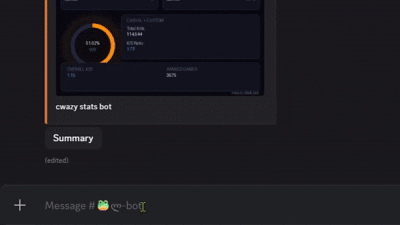

# Critical Ops API — Discord Bot

[](https://www.python.org/)
[](https://discordpy.readthedocs.io/)
[](LICENSE)
[](https://vaxon.cloud/)

> A lightweight, efficient Discord bot (codename: Syrnyk) that integrates with the Critical Ops API to fetch player stats, estimate cheater probability, manage roles, and generate stat card images and capable of **handling ~60–100 users per minute** on a single vCore setup.

> **Disclaimer:** This project is not affiliated with Critical Force or any other organization. It was built by the community, for the community, using publicly available information.

---

## 🕊️ Features

- **Player Stats** — Fetch detailed stats from the Critical Ops API per user request
  - Estimate cheater account probability based on fetched data
- **Stat Card Image Generation** — Renders a clean 1024×1024 px image of all player stats
  - Optimized for minimal CPU usage (~6–11% per request)
- **Role Management** — Assign/remove roles via button press interactions
- **Status Reporting** — Posts bot online/offline notifications to a designated channel

---

## 📺 Workflow



---

## ⚙️ Prerequisites

Before installing, make sure you have:

- **Python 3.8+**
- A **Discord bot token** ([create one here](https://discord.com/developers/applications))
- Access to the **Critical Ops API** (publicly available endpoints)

---

## 📦 Installation

```bash
git clone https://github.com/highk1nda/Critical-Ops-API---Discord-Bot
cd Critical-Ops-API---Discord-Bot
```

Install dependencies:

**Windows:**
```bash
pip install discord.py python-dotenv numpy pillow aiohttp
```

**macOS / Linux:**
```bash
pip3 install discord.py python-dotenv numpy pillow aiohttp
```

---

## 🔑 Configuration

Create a `.env` file in the project root and add your Discord bot token:

```
DISCORD_TOKEN=your_token_here
```

> ⚠️ Never commit your `.env` file to version control. Add it to `.gitignore`.

To configure the **status reporting channel** and **role assignments**, edit the relevant variables in `config/settings.py` and `bot/roles.py` respectively.

---

## 🚀 Running the Bot

```bash
python3 app.py
```

---

## 🗂️ Project Structure

```
SyrnykBot/
│
├── app.py                      # Entry point
├── bot/
│   ├── profile.py              # Profile command and stat card dispatch
│   └── roles.py                # Role management (button events)
├── config/
│   ├── constants.py            # Shared constants (colours, message id's, etc.)
│   └── settings.py             # Bot settings and channel/role IDs
├── core/
│   ├── api.py                  # Critical Ops API handling
│   ├── smurf.py                # Cheater/smurf probability estimator
│   └── stats.py                # Stat parsing and math functions
├── rendering/
│   └── stats_card.py           # 1024×1024 px stats card image generation
├── utils/
│   └── executor.py             # Async thread-pool helpers
├── tests/                      # For me, myself and I :D
├── .env                        # Discord token goes here
└── README.md
```

---

## 🖥️ Hosting

Hosted on **Vaxon Cloud** with the following server specifications:

| Spec | Detail |
|---|---|
| CPU | AMD Ryzen 9 7950X @ 5.7 GHz, 1 vCore |
| RAM | 2 GB DDR5 |
| Storage | 5 GB NVMe SSD |
| DDoS Protection | Yes |

---

## 📊 Performance

Tested on **Vaxon Cloud** (Ryzen 9 7950X @ 5.7 GHz, 1 vCore):

| Metric | Value |
|---|---|
| CPU — image rendering | ~6–11% |
| CPU — image rendering time | less than 1s per request |
| CPU — API requests | ~0.4–1% |
| RAM usage | ~57 MB (stable at idle and under load) |
| Storage usage | ~133 MB |
| Rendered image resolution | 1024×1024 px |

---

## 📈 Scalability

| Scenario | Concurrent Users (worst case load) |
|---|---|
| Image generation (steady load) | ~6–8 users |
| Image generation (burst capacity) | ~10–12 users |

Image rendering takes **<1s per request**, which is solid for a single vCore. At this speed, the bot can handle **~60–100 users** per minute under load.

Limits are mainly CPU-bound from rendering. API-only requests are lightweight and can scale to 100+ concurrent users without issues.

---

## 🔮 Roadmap

- [x] Higher resolution stat card output (1024×1024 px)
- [ ] AI Chat-bot features (Groq, Google Gemini)
- [ ] Leaderboard / server ranking feature
- [ ] Additional stat categories and API endpoints
---

## 🤝 Contributing

Contributions, issues, and feature requests are welcome. Feel free to open an issue or submit a pull request.

---

<p align="center">
  <strong>Have fun, do pobachennya 👋</strong>
</p>

<p align="center">
  <a href="https://github.com/highk1nda">More projects by highk1nda 🚧</a>
</p>
